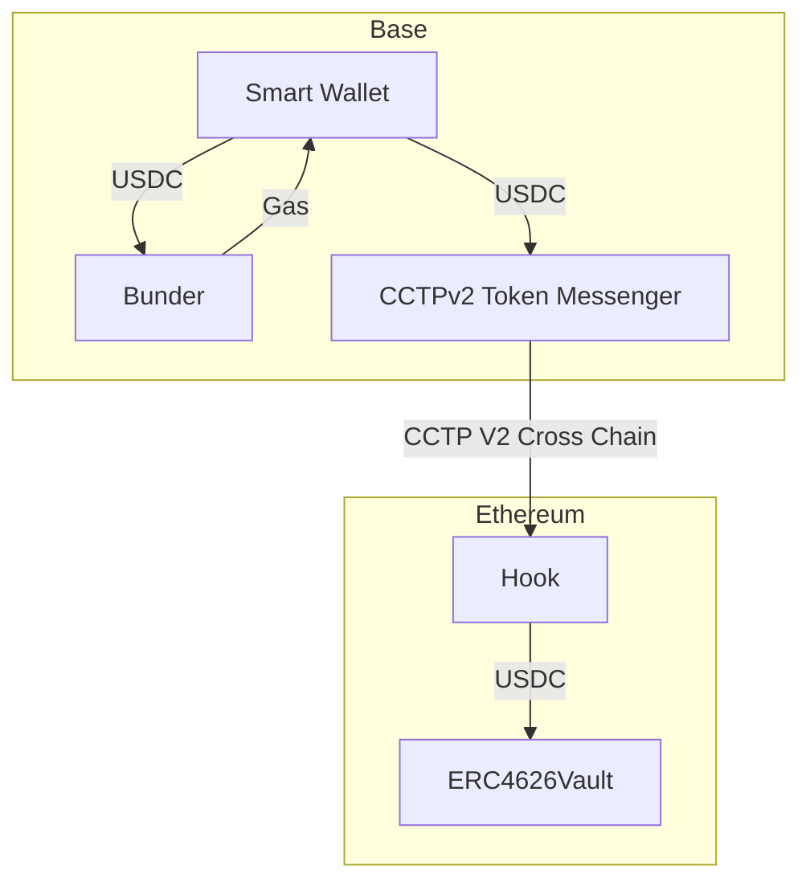

# Absynth - Stable coin focus Smart Wallet System

A cutting-edge decentralized application (dApp) that leverages blockchain technology to create positive impact. 
Absynth combines modern web technologies with smart contracts to deliver a seamless and secure decentralized experience.

## 🌟 Features

- Circle CCTP cross chain transfer, with customized hook
- Circle Modular Wallet with passkey authentication
- Frontend web application built with modern technologies
- Smart contracts for blockchain interaction
- Secure and decentralized architecture

## 🏗 Architecture

About 
- CCTP: https://developers.circle.com/stablecoins/generic-message-passing
- Circle Modular Wallet: https://developers.circle.com/w3s/modular-wallets-web-sdk#installation


### Smart Wallet Transaction flow 




## 🔧 Technical Components

### Modular Wallet
- Circle's modular wallet infrastructure integration
- Passkey-based authentication system
- Cross-chain transfer capabilities through CCTP
- Multi-chain USDC token management
- Integrated charity donation system

### Smart Wallet
- Account abstraction with WebAuthn credentials
- Pimlico integration for gas sponsorship
- USDC transfer and approval management
- CCTP cross-chain messaging system
- Kernel smart account implementation

### Security Features
- Secure credential management
- Token approval controls
- Cross-chain message verification
- Transaction validation and attestation
- Secure storage of sensitive data

## 🚀 Getting Started

### Prerequisites

- Node.js (v16 or higher)
- PNPM package manager
- A modern web browser

### Installation

1. Clone the repository:
   ```bash
   git clone https://github.com/LJlkdskdjflsa/Absynth.git
   cd absynth
   ```

2. Install dependencies:
   ```bash
   pnpm install
   ```

3. Set up environment variables:
   ```bash
   cp .env.example .env
   # Edit .env with your configuration
   ```

4. Start the development server:
   ```bash
   cd frontend
   pnpm dev
   ```

## 🏗️ Project Structure

```
absynth/
├── frontend/          # Frontend application
├── contracts/         # Smart contracts
├── package.json      # Project dependencies
└── README.md         # Project documentation
```

## 💻 Technology Stack

- Frontend:
  - Next.js 
- Smart Contracts:
  - Foundry
- Development Tools:
  - PNPM
  - Axios

## 🔧 Configuration

Please check the `.env.example`

## 🤝 Contributing

We welcome contributions to the Better World project! Please follow these steps:

1. Fork the repository
2. Create a feature branch (`git checkout -b feature/amazing-feature`)
3. Commit your changes (`git commit -m 'Add some amazing feature'`)
4. Push to the branch (`git push origin feature/amazing-feature`)
5. Open a Pull Request

## 📝 License

MIT

---

⭐️ If you find this project useful, please consider giving it a star!
